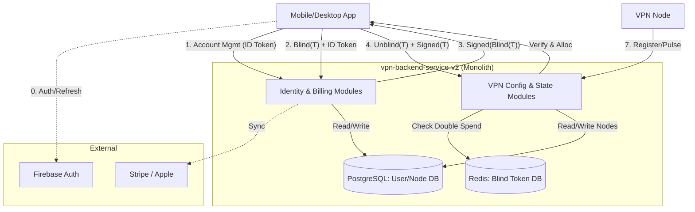
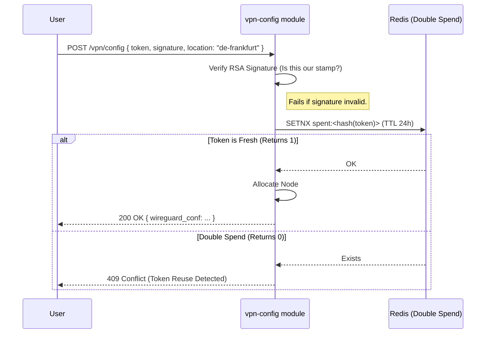
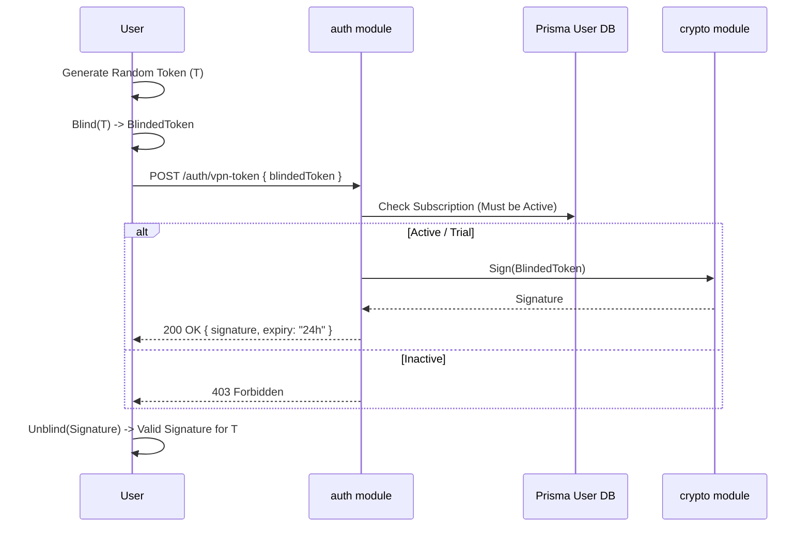
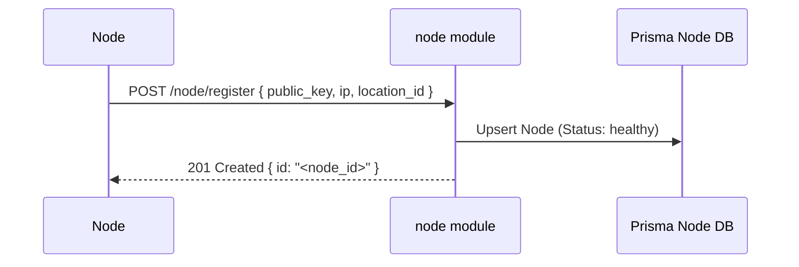
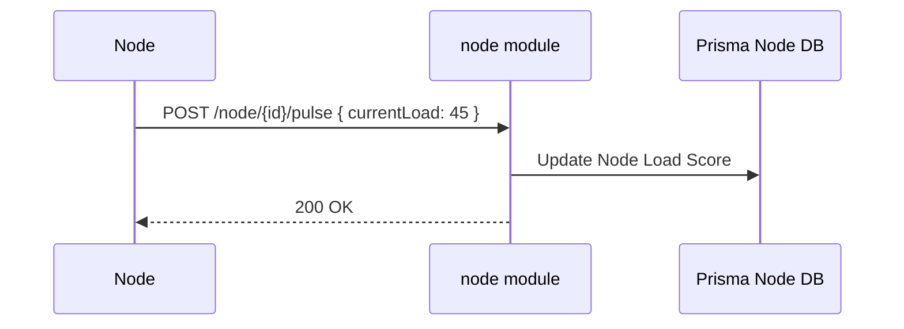

# B2C Backend Detailed Design (Node.js / NestJS)

> **Framework**: [NestJS](https://nestjs.com/) (TypeScript).
> **Architecture**: Majestic Monolith.
> **Database**: PostgreSQL (User Data, Analytics) via Prisma ORM, Redis (Ephemera/Blind Tokens).

## 1. High-Level Architecture

We use a **NestJS Monolith** for backend functions. The internal modules maintain strict boundary segregation to mimic microservices (Church and State Privacy).



## 2. End-to-End System Flows

### 1. VPN Connection: Happy Path (Active Sub or Trial)

* **Goal**: The complete journey from a valid user to an active VPN connection.
* **Pre-requisite**: User requested a Blind Token via `POST /auth/vpn-token` using a valid JWT.



## 3. Folder Structure (`src/`)

```text
/vpn-backend-service-v2/src/
├── account/          # User profile and history management
├── auth/             # Firebase identity verification & session
├── connection/       # VPN session state tracking
├── crypto/           # Blind Signature & cryptographic utilities
├── logger/           # Centralized logging
├── nodes/            # Edge VPN node registration and fleet state
├── notifications/    # Email/Push alerts
├── payment/          # Stripe webhooks & processing
├── preferences/      # User app configuration
├── prisma/           # Database ORM client and schema
├── subscription/     # Plan provisioning and access control
└── vpn-config/       # Anonymous token redemption & WireGuard key exchange
```

## 4. Prisma Database Schema

We use Prisma for our PostgreSQL schema. We strictly separate Identity tables from Network tables via application logic.

### User & Identity Entities

- `User`: Core identity, references Firebase UID.
* `Subscription`: Billing states corresponding to a User.
* `PaymentHistory`: Transaction logs.
* `UserPreferences`: Configuration parameters per user.

### Network & Infrastructure Entities

- `Location`: Available geographical VPN routing regions.
* `Node`: Edge VPN Daemon definitions and active runtime state.
* `Connection`: Active session history. It deliberately lacks a `user_id` relation to preserve zero-logs privacy.

## 5. Token Generation (The Blind Sign)

1. **Token Request**:
    * *Goal*: Obtain valid anonymous signature.
    * *Prerequisite*: Valid Firebase ID Token + Active Subscription.



## 6. Config Service & Node Flows

1. **Node Registration (Startup)**:
    * *Goal*: A new ephemeral node registers itself with the Monolith API.



1. **Node Pulse (Health)**:
    * *Goal*: Report liveliness and load.


