# C4 Component Architecture

The Component diagram zooms into individual containers to show the internal structural building blocks. Below is the Component diagram specifically for the **Backend API Service V2**, mapping out the critical NestJS modules that coordinate business capabilities.

```mermaid
C4Component
    title Component diagram for KeenVPN Backend API V2

    Container(vpn_app, "VPN Client App", "Flutter, Swift, Kotlin", "Client application requesting VPN server lists and account details.")
    Container(node_daemon, "VPN Node Daemon", "Node.js, WireGuard", "Edge node registering its health and requesting client public keys.")
    
    ContainerDb(database, "Primary Database", "Neon Serverless PostgreSQL", "Relational database holding core system state.")
    System_Ext(firebase, "Firebase Auth", "External identity provider.")
    System_Ext(stripe, "Stripe", "External payment provider.")

    Container_Boundary(backend_api, "Backend API Service V2") {
        Component(auth_module, "Auth Module", "NestJS Module", "Extracts, validates, and decodes Firebase JWTs. Extracts opaque Node Tokens.")
        
        Component(account_module, "Account Module", "NestJS Module", "Provides user profile data and links Firebase UIDs to internal accounts.")
        Component(subscription_module, "Subscription Module", "NestJS Module", "Manages Stripe plans, prices, and handles incoming Stripe webhooks.")
        Component(payment_module, "Payment Module", "NestJS Module", "Processes Stripe Checkouts and updates subscription state in the database.")
        
        Component(nodes_module, "Nodes Module", "NestJS Module", "Tracks the active VPN fleet, scores node health, and assigns clients to optimal geographic servers.")
        Component(vpn_config_module, "VPN Config Module", "NestJS Module", "Handles cryptographic routing. Manages WireGuard internal IPs and Public Keys for active sessions.")
        
        Component(connection_module, "Connection Module", "NestJS Module", "Records traffic metrics, connection events, and bandwidth aggregation per session.")
        Component(sales_contact_module, "Sales Contact Module", "NestJS Module", "Validates and ingests B2B enterprise inquiries directly into the database.")
        Component(prisma_module, "Prisma Module", "NestJS Core Module", "Provides an injected dependency for secure, typed Database access using Prisma Client.")
    }

    Rel(vpn_app, auth_module, "Sends requests to", "JSON/HTTPS")
    Rel(node_daemon, auth_module, "Authenticates via Token to", "JSON/HTTPS")
    Rel(stripe, subscription_module, "Sends Webhooks to", "JSON/HTTPS")

    Rel(auth_module, firebase, "Verifies Tokens via", "Firebase Admin SDK")

    Rel(auth_module, account_module, "Authorizes", "Method Call")
    Rel(auth_module, vpn_config_module, "Authorizes", "Method Call")
    Rel(auth_module, nodes_module, "Authorizes", "Method Call")

    Rel(account_module, subscription_module, "Checks status using", "Method Call")
    Rel(payment_module, stripe, "Creates Sessions using", "Stripe API")

    Rel(vpn_config_module, nodes_module, "Fetches Node IPS from", "Method Call")
    
    Rel(account_module, prisma_module, "Reads/Writes", "Prisma Client")
    Rel(subscription_module, prisma_module, "Reads/Writes", "Prisma Client")
    Rel(nodes_module, prisma_module, "Reads/Writes", "Prisma Client")
    Rel(vpn_config_module, prisma_module, "Reads/Writes", "Prisma Client")
    Rel(connection_module, prisma_module, "Reads/Writes", "Prisma Client")
    Rel(sales_contact_module, prisma_module, "Writes", "Prisma Client")

    Rel(prisma_module, database, "Executes queries against", "PostgreSQL/TCP")
```

## Component Description

* **Auth Module**: Protects all internal endpoints. Uses `Passport.js` with Firebase strategies for user clients, and custom guards for API Keys (Nodes).
* **Prisma Module**: The data-access layer. Instantiates the connection pool for PostgreSQL and exposes it across the service boundary.
* **Modules (Nodes/VPN Config...)**: Domain-driven feature repositories isolating business logic corresponding to their distinct responsibilities.
