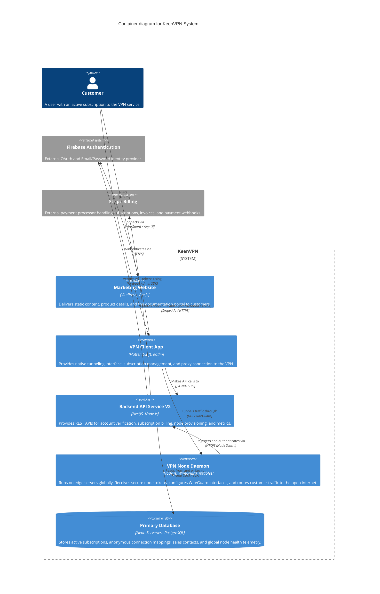

# C4 Container Architecture

The Container diagram shows the high-level shape of the **KeenVPN** software architecture and how responsibilities are distributed across it. It also shows the major technology choices and how the containers communicate with one another.

## Containers Description

* **Marketing Website**: A statically generated VitePress site deployed directly to edge CDNs (like Netlify or Vercel) focusing on fast load times, SEO, and developer documentation.
* **VPN Client App**: Native/Cross-platform applications installed on the user's mobile device or computer. Interacts primarily with the Backend V2 for subscription and server listing, and the Node Daemon for secure traffic routing.
* **Backend API Service V2**: A stateless, serverless-ready NestJS application leveraging Domain-Driven Design for managing the physical infrastructure mappings, verifying subscriptions via Stripe, and ensuring token validity relative to Firebase identities.
* **VPN Node Daemon**: A lightweight background service running on Linux VPS instances worldwide (provisioned by Ansible/Terraform) that strictly manages WireGuard peer addition/removal.
* **Primary Database**: Our persistence layer hosted on Neon, designed for serverless scalability.
* **External Systems**: Firebase and Stripe remove identity and payment compliance requirements from our direct servers.
