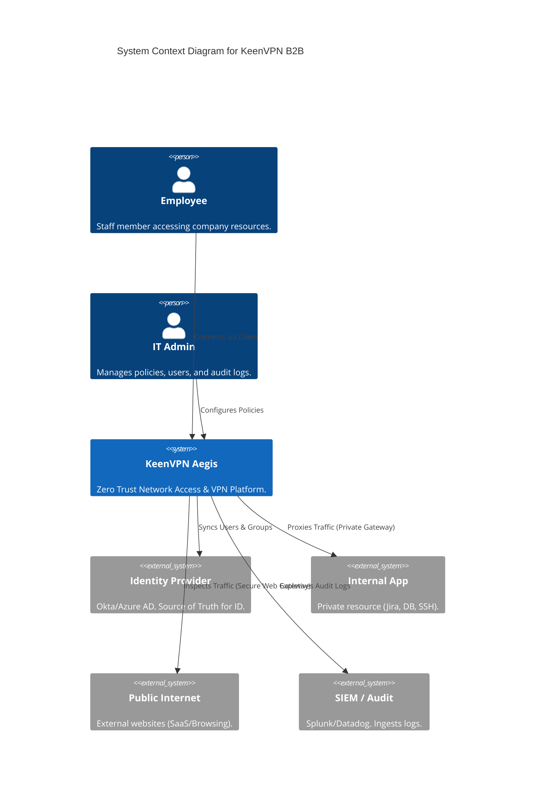
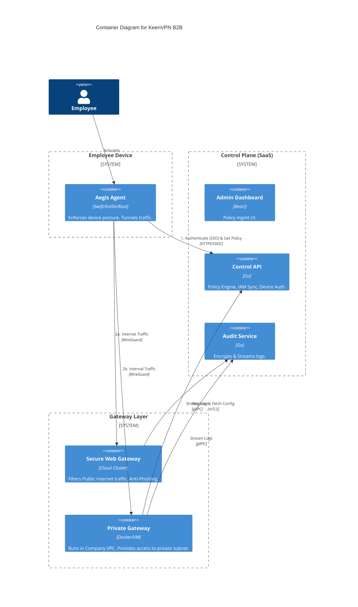
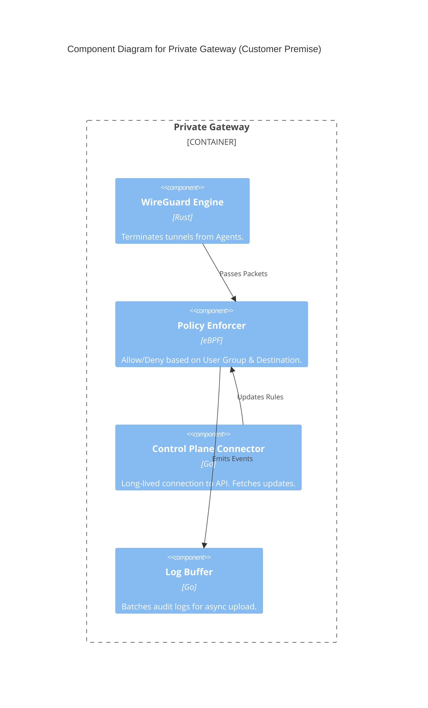
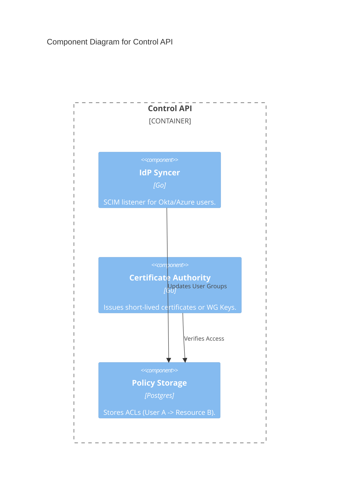

# C4 Model: KeenVPN B2B ("Project Aegis")

> **Scope**: Enterprise VPN / ZTNA (Security & Control Focus).
> **Notation**: C4 (Context, Containers, Components).

## Level 1: System Context Diagram

## Level 2: Container Diagram

## Level 3: Component Diagram (Private Gateway)

## Level 3: Component Diagram (Control API)

