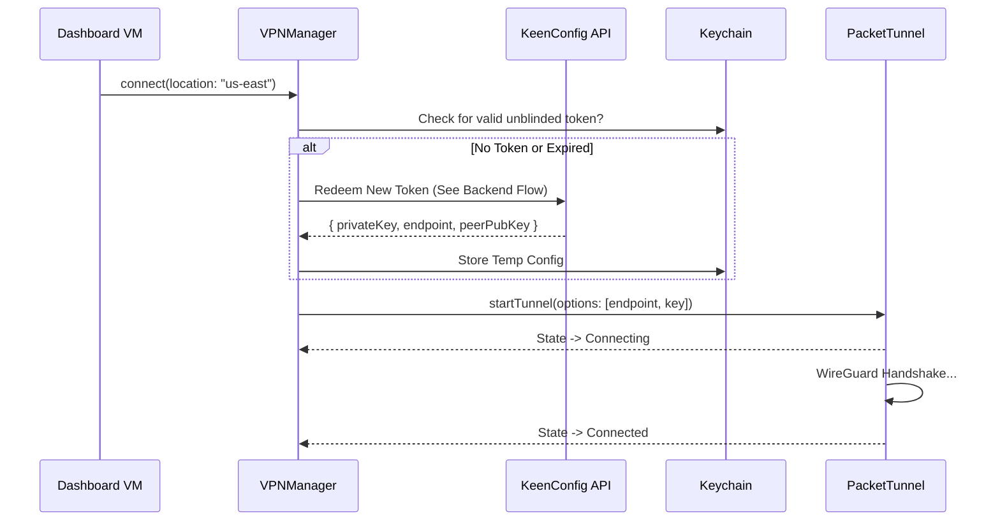

# Client Detailed Design: iOS & macOS

> **Language**: Swift 6.
> **Platforms**: iOS 17+, macOS 14+.
> **Architecture**: MVVM-C (Model-View-ViewModel + Coordinators).
> **Concurrency**: Swift Concurrency (`async/await`, `Actors`).

## 1. Project Structure (Xcode Workspace)

We will use a **Monorepo** approach with a single `.xcworkspace` containing:

### Targets

1. **`KeenVPN_iOS`** (App): The main iOS application.
2. **`KeenVPN_macOS`** (App): The main macOS application (AppKit/SwiftUI).
3. **`PacketTunnel`** (Network Extension): The VPN process.
4. **`ContentFilter`** (Network Extension): The AdBlock process.
5. **`KeenVPNCore`** (Local Swift Package): Shared business logic.

### `KeenVPNCore` Modules

The shared package will satisfy the "Church & State" separation by isolating Auth from Tunneling where possible, though the App needs both.

* **`CoreNetworking`**: `APIClient` using `async/await`. Handles Retry, Reachability.
* **`CoreAuth`**:
  * `AuthService`: Firebase / SIWA (Sign In With Apple) integration.
  * `CryptoUtils`: RSA Blind Signature overrides (using `SwiftyRSA` or C-Bridge).
* **`CoreVPN`**:
  * `VPNManager`: Singleton/Actor wrapper around `NETunnelProviderManager`.
  * `VPNStateMachine`: Defines states (`disconnected`, `connecting`, `connected`, `pausing`).
* **`CoreData`**:
  * `PersistenceController`: CoreData stack for User preferences and *local* usage stats.
  * `AppGroup`: Helper to read/write `UserDefaults` in the shared App Group container.

## 2. App Architecture (MVVM + Coordinator)

We avoid Massive ViewControllers by separating Navigation (Coordinators) from Logic (VMs).

### Navigation Flow (Coordinator)

* **`AppCoordinator`**: Root. Decides generic flow (Login vs Dashboard).
  * `start()` check `AuthService.isLoggedIn`.
* **`OnboardingCoordinator`**:
  * `LoginVC` -> `SubscriptionVC` (IAP) -> `VPNPermissionVC` (Install Profile).
* **`DashboardCoordinator`**:
  * `HomeVC` (Map/Status) -> `LocationSelectVC` -> `SettingsVC`.

### State Management

* **VPN State**: Global Actor `VPNStatusService`.
  * Observes `CFNotification` from the Network Extension.
  * Publishes `@Published var status: VPNStatus`.
  * UI binds to this for the "Big Green Button" animation.

## 3. Key Workflows & Sequences

### A. Connection Sequence (The "Blind" Handshake)



### B. "Smart" Location Selection

1. **Fetch**: `API.getLocations()` calculates latency server-side or returns list.
2. **Display**: Group by Country/City. Show "Load" indicators (Green/Yellow/Red).
3. **Ping**: App optionally ICMP ping top 3 to verify latency locally.

### C. The "Kill Switch" Logic (App Side)

* The App sets `connectionOnDemand` rules in the `NEVPNManager`.
* If user manually disconnects: `manager.isOnDemandEnabled = false`.
* If "Always On" is active: `manager.isOnDemandEnabled = true` (System auto-reconnects).

## 4. Implementation Details

### Data Models

```swift
// CoreVPN
struct ServerLocation: Codable, Identifiable {
    let id: String         // "us-east-1"
    let name: String       // "New York"
    let countryCode: String // "US"
    let load: Int          // 0-100
    let premium: Bool      // If locked behind subscription
}

// Analytics (Local Only)
struct UsageSession: Identifiable {
    let startTime: Date
    var endTime: Date?
    var bytesIn: Int64
    var bytesOut: Int64
    var trackersBlocked: Int
}
```

### Blind Token Crypto (Swift)

Since native `CryptoKit` doesn't fully support low-level RSA Blind Signatures easily, we will use a C-interop or a specific library like `SwiftyRSA` to:

1. Generate random `msg`.
2. Blind `msg` with random `r` -> `blinded_msg`.
3. Send to backend.
4. Unblind signature `s'` -> `s`.
5. Verify `s` against Issuer Public Key.

### IAP (RevenueCat or Native StoreKit 2)

* **Recommendation**: Use **StoreKit 2** (Native). It's robust enough now.
* **Verifier**: Send `transaction.jwsRepresentation` to `auth-service` for validation.

## 5. UI/UX Specifications

* **Map**: Utilize `MapKit` with custom annotations for Server Locations.
* **Animations**: Lottie or Rive for the "Connecting" state (pulsing shield).
* **Haptics**: `UIImpactFeedbackGenerator` on connection success.
