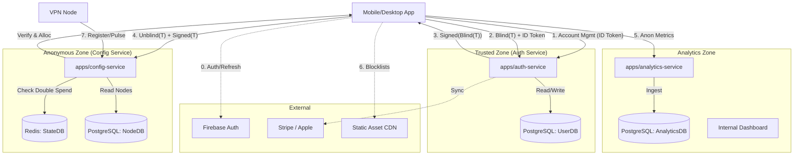
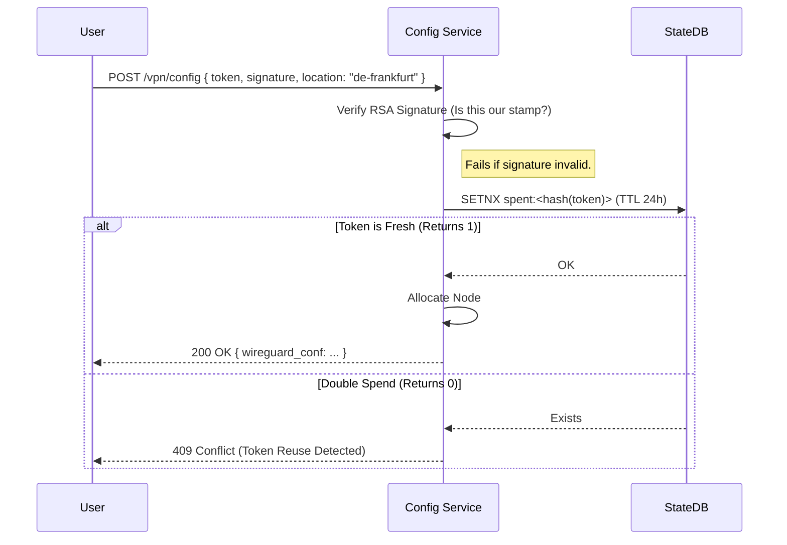
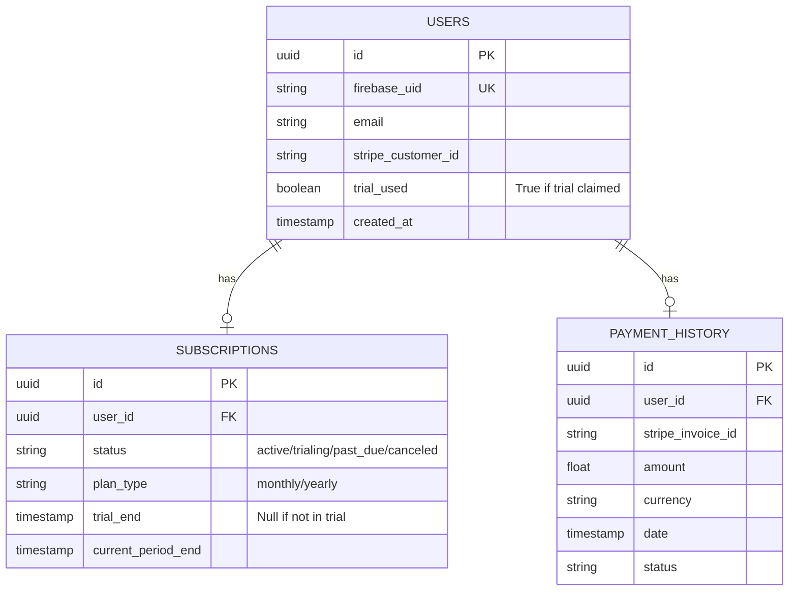
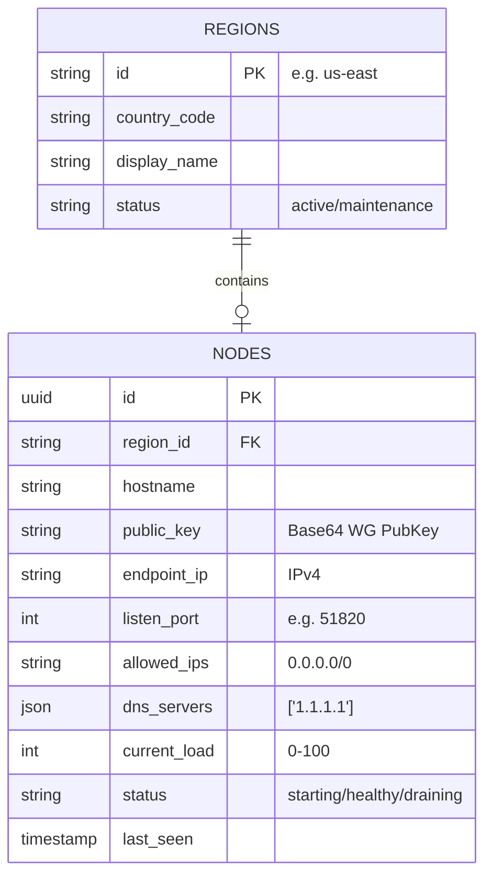
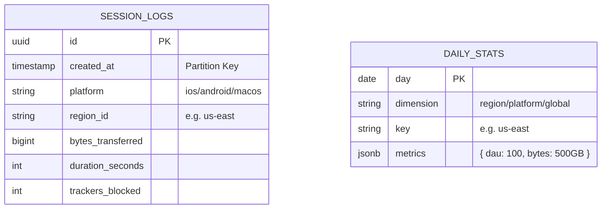
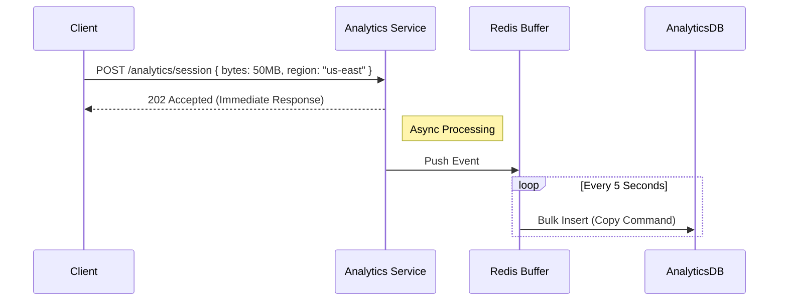
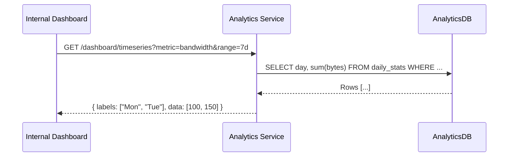

# B2C Backend Detailed Design (Node.js / NestJS)

> **Framework**: [NestJS](https://nestjs.com/) (TypeScript).
> **Architecture**: Monorepo (Nx or Nest Workspace).
> **Database**: PostgreSQL (User Data, Analytics), Redis (Ephemera/Blind Tokens).

## 1. High-Level Architecture

We will use a **NestJS Monorepo** for shared logic and modular services.



## 2. End-to-End System Flows

### 1. VPN Connection: Happy Path (Active Sub or Trial)

* **Goal**: The complete journey from a valid user to an active VPN connection.
* **Pre-requisite**: User requested a Blind Token via `POST /auth/vpn-token` using a valid JWT.



## 3. Folder Structure (NestJS Monorepo)

### Root Structure

```text
/backend
├── apps/
│   ├── auth-service/
│   ├── config-service/
│   └── analytics-service/
├── libs/
│   ├── common/           # Shared DTOs, Guards, Decorators
│   ├── crypto/           # Blind Signature Logic (RSA-FDH / Node Buffer)
│   ├── database/         # TypeORM/Prisma Configs
│   └── wireguard/        # Node Selection Algorithms
├── package.json
└── nx.json
```

## 4. Auth Service Design (`apps/auth-service`)

* **Description**: The **Trusted Zone** service. It is the only service with access to PII (Email, Payment Details). It serves three critical roles:
    1. **Identity Provider**: Validates Firebase credentials and manages User Sessions.
    2. **Payment Authority**: Interfaces with Stripe and Apple to process subscriptions, cancellations, and handle webhook events (Refunds/Disputes).
    3. **Blind Signer**: Issues anonymous, cryptographically signed tokens (`Blind(T)`) to valid subscribers, bridging the gap to the anonymous Config Service.
* **Modules**:
  * `AuthModule`:
    * `AuthController`: Public endpoints for Login (`/login`) and Logout.
    * `TokenController`: Endpoint for Blind Signing (`/vpn-token`).
    * `AuthService`: Validates Firebase ID Tokens; Orchestrates User Creation.
  * `AccountModule`:
    * `AccountController`: Protected endpoints for User Profile and Payment History.
    * `AccountService`: Aggregates data from `UserDB` and Stripe/Apple services.
  * `PaymentModule`:
    * `StripeService`: Manages Checkout Sessions, Portal Links, and Cancellations via API.
    * `AppleService`: Validates App Store Receipts (`verifyReceipt`) and interprets Notification Payloads.
    * `SubscriptionService`: Core logic for "Active vs Inactive" state, handling Renewals/Expiry logic updates in `UserDB`.
    * `WebhookController`: Public listeners for `stripe` and `apple` events.
  * `CryptoModule`:
    * `BlindSignerService`: RSA-FDH signing logic using the loaded Private Key.
* **Key Files**:
  * `src/auth/auth.controller.ts`: Login & Session logic.
  * `src/auth/token.controller.ts`: The Blind Signing flow (`block_blind_sign`).
  * `src/account/account.controller.ts`: `get_payment_history`, `delete_account`.
  * `src/payment/subscription.service.ts`: Central logic for Plan State (Trial/Active/Canceled).
  * `src/payment/webhooks.controller.ts`: Handles `invoice.payment_succeeded`, `REFUND`, `DID_CHANGE_RENEWAL_STATUS`.
* **API Endpoints**:
  * **Authentication**:
    * `POST /auth/login`: Validate Firebase ID Token, Sync UserDB, return Profile.
    * `POST /auth/logout`: Server-side cleanup (if any).
    * `POST /auth/vpn-token`: Request Blind Signature for VPN access (`{ blindToken }`).
  * **User Management**:
    * `GET /user/profile`: Get user details + current subscription status.
    * `DELETE /user/account`: Permanently delete account & data (GDPR/CCPA).
  * **Account & Payments**:
    * `GET /account/payments`: List payment history (dates, amounts, status).
    * `GET /account/invoices/:id/pdf`: Download invoice PDF.
  * **Subscriptions**:
    * `GET /subscriptions/plans`: List public pricing plans (Monthly/Yearly) & Trial info.
    * `POST /subscriptions/checkout`: Create Stripe Checkout Session (for Web/Android).
    * `POST /subscriptions/apple-receipt`: Validate/Sync Apple IAP Receipt.
    * `POST /subscriptions/manage`: Get portal link (Stripe Customer Portal).
    * `POST /subscriptions/cancel`: Cancel active subscription (Stripe only; Apple users redirected).
  * **Webhooks (Public)**:
    * `POST /webhooks/stripe`: Handle `invoice.payment_succeeded`, `charge.refunded`, `charge.dispute.created`.
    * `POST /webhooks/apple`: Handle `DID_RENEW`, `REFUND`, `DID_CHANGE_RENEWAL_STATUS`.

    * `POST /webhooks/apple`: Handle `DID_RENEW`, `REFUND`, `DID_CHANGE_RENEWAL_STATUS`.

### Database Design (UserDB)

* **Type**: PostgreSQL
* **Role**: Strictly stores Account & Payment data. NO Usage logs.



### Auth Service User Flows

#### A. Identity & Onboarding

* **1. User Login / Signup (Account Creation Only)**:
  * *Goal*: Authenticate with Firebase, create UserDB record.
  * *Constraint*: No subscription created yet.

    ```mermaid
    sequenceDiagram
        participant User
        participant FB as Firebase Auth
        participant Auth as Auth Service
        participant DB as UserDB

        User->>FB: Sign In (Google/Apple)
        FB-->>User: ID Token
        User->>Auth: POST /auth/login { idToken }
        Auth->>FB: Verify Token -> Get UID
        Auth->>DB: Find/Create User (Status: Created)
        Auth-->>User: 200 OK { user: { id: "...", plan: null }, session: "..." }
    ```

* **2. Signup with 1-Month Free Trial (Stripe)**:
  * *Goal*: User subscribes via Web/Android.

    ```mermaid
    sequenceDiagram
        participant User
        participant Auth
        participant Stripe

        User->>Auth: POST /subscriptions/checkout { plan: "monthly" }
        Auth->>Stripe: Create Checkout Session (mode=subscription, trial=30d)
        Stripe-->>Auth: url
        Auth-->>User: { checkoutUrl: "..." }
        
        User->>Stripe: Enters CC Details -> Confirm
        Stripe->>Auth: Webhook: customer.subscription.created (status=trialing)
        Auth->>DB: Update User Plan (Trial Active)
    ```

* **3. Signup with 1-Month Free Trial (Apple IAP)**:
  * *Goal*: User subscribes via iOS App.

    ```mermaid
    sequenceDiagram
        participant App as iOS App
        participant Apple as Apple Store
        participant Auth
        participant DB as UserDB

        App->>Apple: Buy Subscription (Free Trial included in StoreKit Config)
        Apple-->>App: Payment Success + Receipt
        App->>Auth: POST /subscriptions/apple-receipt { receipt }
        
        Auth->>Apple: Verify Receipt
        Apple-->>Auth: { status: 0, latest_receipt_info: { is_trial_period: "true" } }
        Auth->>DB: Update User Plan (Trial Active)
        Auth-->>App: 200 OK { plan: "monthly", status: "trialing" }
    ```

#### B. Subscription Lifecycle

* **4. Auto-Renewal (Stripe)**:

    ```mermaid
    sequenceDiagram
        participant Stripe
        participant Auth
        participant DB as UserDB

        Stripe->>Auth: Webhook: invoice.payment_succeeded
        Auth->>DB: Extend 'current_period_end'
        Auth->>DB: Log Payment to 'payment_history'
        Auth-->>Stripe: 200 OK
    ```

* **5. Auto-Renewal (Apple IAP)**:

    ```mermaid
    sequenceDiagram
        participant Apple
        participant Auth
        participant DB as UserDB

        Apple->>Auth: Server Notification: DID_RENEW
        Auth->>DB: Extend 'current_period_end'
        Auth->>DB: Log Payment to 'payment_history'
        Auth-->>Apple: 200 OK
    ```

* **6. Cancel Subscription (Stripe)**:

    ```mermaid
    sequenceDiagram
        participant User
        participant Auth
        participant Stripe
        participant DB as UserDB

        User->>Auth: POST /subscriptions/cancel
        Auth->>Stripe: Update Sub (cancel_at_period_end=true)
        Stripe-->>Auth: OK
        Auth->>DB: Set status="canceled"
        Auth-->>User: 200 OK { active_until: "2024-12-31" }
    ```

* **7. Cancel Subscription (Apple IAP)**:

    ```mermaid
    sequenceDiagram
        participant User
        participant Auth
        participant Apple
        participant DB as UserDB

        Note over User, Auth: Scenario A: User clicks "Cancel" in App
        User->>Auth: POST /subscriptions/cancel
        Auth-->>User: 409 Conflict { error: "ios_iap", url: "https://apps.apple.com/..." }
        
        Note over Apple, Auth: Scenario B: User cancels in iOS Settings
        Apple->>Auth: Server Notification: DID_CHANGE_RENEWAL_STATUS (subtype=AUTO_RENEW_DISABLED)
        Auth->>DB: Set cancel_at_period_end=true
        Auth-->>Apple: 200 OK
    ```

* **8. Refunds (Stripe)**:

    ```mermaid
    sequenceDiagram
        participant Admin
        participant Stripe
        participant Auth
        participant DB as UserDB

        Note over Admin, Auth: Trigger A: Admin Initiated
        Admin->>Stripe: Refund Payment
        Stripe->>Auth: Webhook: charge.refunded
        Auth->>DB: Update Payment History (REFUNDED)
        Auth->>DB: Revoke Subscription (Immediate)
        
        Note over Stripe, Auth: Trigger B: Dispute Created/Won
        Stripe->>Auth: Webhook: charge.dispute.created
        Auth->>DB: Flag Account (Risk)
        Auth->>DB: Revoke Subscription
    ```

* **9. Refunds (Apple IAP)**:

    ```mermaid
    sequenceDiagram
        participant Apple
        participant Auth
        participant DB as UserDB

        Apple->>Auth: Server Notification: REFUND
        Auth->>DB: Update Payment History (REFUNDED)
        Auth->>DB: Revoke Subscription (Immediate)
        Auth-->>Apple: 200 OK
    ```

#### C. API Access Control

* **10. Access Scenarios (Protected vs Public)**:

    ```mermaid
    sequenceDiagram
        participant Client
        participant API as Auth Service
        participant Guard as AuthGuard

        Note over Client, API: Scenario: Public Endpoint
        Client->>API: GET /subscriptions/plans
        API-->>Client: 200 OK (Public Data)

        Note over Client, API: Scenario: Protected (Valid Token)
        Client->>API: GET /user/profile { Auth: Bearer Valid_JWT }
        Guard->>Guard: Verify JWT (Sig + Exp)
        Guard-->>API: Allow
        API-->>Client: 200 OK { profile: ... }

        Note over Client, API: Scenario: Expired Token (Refreshed)
        Client->>API: GET /user/profile { Auth: Bearer Expired_JWT }
        Guard-->>Client: 401 Unauthorized
        Client->>FB: Refresh Token
        FB-->>Client: New_JWT
        Client->>API: GET /user/profile { Auth: Bearer New_JWT }
        API-->>Client: 200 OK

        Note over Client, API: Scenario: No / Invalid Token
        Client->>API: GET /user/profile { Auth: Bearer Trash }
        Guard-->>Client: 403 Forbidden
    ```

#### D. Token Generation (The Blind Sign)

* **11. Token Request**:
  * *Goal*: Obtain valid anonymous signature.
  * *Prerequisite*: Valid Firebase ID Token + Active Subscription.

    ```mermaid
    sequenceDiagram
        participant User
        participant Auth
        participant DB as UserDB
        participant Crypto as CryptoService

        User->>User: Generate Random Token (T)
        User->>User: Blind(T) -> BlindedToken
        
        User->>Auth: POST /auth/vpn-token { idToken, blindedToken }
        Auth->>DB: Check Subscription (Must be Active)
        
        alt Active / Trial
            Auth->>Crypto: Sign(BlindedToken)
            Crypto-->>Auth: Signature
            Auth-->>User: 200 OK { signature, expiry: "24h" }
        else Inactive
            Auth-->>User: 403 Forbidden
        end

        User->>User: Unblind(Signature) -> Valid Signature for T
    ```

## 5. Config Service Design (`apps/config-service`)

* **Description**: The **Anonymous Helper** service & **Fleet Manager**.
  * **User Facing**: Trades Valid Blinded Tokens for WireGuard Configurations (1:1 exchange). It has NO understanding of User Identity.
  * **Infrastructure Facing**: Manages the lifecycle of VPN Nodes. Registers new nodes, processes high-frequency Heartbeats ("Pulses"), and evicts dead nodes.
  * **Alerting**: Monitors fleet health and triggers Slack notifications to `#ops-infrastructure` for critical events (High Load, Dead Nodes).
* **Responsibilities**:
    1. **Fleet Management**: Registers new nodes (`POST /nodes/register`) and tracks their health via Pulses.
    2. **Location Discovery**: Publicly lists available VPN regions (`GET /vpn/locations`) by querying healthy nodes in `NodeDB`.
    3. **Token Verification**: Verifies `BlindedToken` signatures using the Auth Service's Public Key.
    4. **Double-Spend Protection**: Checks `StateDB` (Redis) to ensure a token is only used once per 24h.
    5. **Optimal Node Selection**: Selects the best node in **O(1)** time using Redis Sorted Sets (`StateDB`), based on a weighted score of CPU, Bandwidth, and Connections.
    6. **Config Generation**: Returns the `Peer` and `Interface` keys for the selected node.
* **Modules**:
  * `RedemptionModule`:
    * `RedemptionController`: The `POST /vpn/config` endpoint. Trades Token -> Config.
    * `TokenGuard`: Middleware that parses and verifies the RSA Signature.
    * `SpendGuard`: Redis interactions to prevent Replay Attacks (`SETNX`).
  * `AllocationModule`:
    * `NodeSelectorService`: Queries Redis Sorted Sets (`ZRANGE`) to find the least loaded node.
  * `NodeManagementModule`:
    * `NodeController`: Internal endpoints (`/nodes/register`, `/nodes/pulse`).
    * `IngestService`: High-performance metric processor. Updates Redis Scores & SQL Status.
  * `LocationModule`:
    * `LocationController`: Public `GET /vpn/locations` endpoint. Returns distinct healthy regions.
  * `NotificationModule`:
    * `SlackService`: Async webhook client for alerts.
  * `DatabaseModule` (Shared):
    * `NodeEntity`: Postgres Entity.
* **Key Files**:
  * `src/redemption/redemption.controller.ts`: Main entry point for trading tokens.
  * `src/node-management/ingest.service.ts`: Handles Heartbeats. Uses `ZADD` to update Node Scores in `StateDB`.
  * `src/allocation/load-balancer.ts`: Optimization logic (`return redis.zrange(key, 0, 0)`).
  * `src/notification/slack.service.ts`: `sendAlert(message, level)`.
* **API Endpoints**:
  * **Public (Client)**:
    * `GET /vpn/locations`: List active regions (`["us-east", "eu-central", ...]`).
    * `POST /vpn/config`: Exchange Signed Blind Token for WireGuard Creds.
      * **Input**: `{ token, signature, locationId }`
      * **Output**: `{ endpoint, publicKey, allowedIPs, privateKey }`
  * **Infrastructure (Nodes) - mTLS/API Key Protected**:
    * `POST /nodes/register`: Register new node (`{ public_key, endpoint_ip, location_id }`).
    * `POST /nodes/pulse`: Send Health/Metrics (`{ cpu_percent, bandwidth_mbps, active_connections }`).

    * `POST /nodes/pulse`: Send Health/Metrics (`{ cpu_percent, bandwidth_mbps, active_connections }`).

### Database Design (Config Service)

#### StateDB (Redis)

Stores ephemeral state for Load Balancing and Replay Protection.

* **Replay Protection**:
  * **Key**: `spent:<token_hash>` (TTL 24h)
  * **Value**: `timestamp`
* **Infrastructure**:
  * **Key**: `location:<id>:nodes` (Set)
  * **Value**: Member list of `<node_id>`
* **Load Balancer**:
  * **Key**: `nodes:region:<id>` (Sorted Set)
  * **Score**: `LoadScore` (0-100)
  * **Member**: `<node_id>`

#### NodeDB (Postgres)

Stores Server Configs and Real-time Status. NO User Data.



### Config Service & Node Flows

#### A. Fleet Management (Infrastructure)

* **1. Node Registration (Startup)**:
  * *Goal*: A new ephemeral node registers itself.
  * *Alerting*: Notification sent to Slack `#ops-infrastructure`.

    ```mermaid
    sequenceDiagram
        participant Node
        participant Config as Config Service
        participant DB as NodeDB
        participant Redis as StateDB
        participant Slack as SlackService

        Node->>Config: POST /nodes/register { public_key, ip, location_id }
        Config->>DB: Upsert Node (Status: Starting)
        Config->>Redis: Add to 'location:<id>:nodes' Set
        
        par Async Notification
            Config->>Slack: Send("New Node Registered: 10.0.0.1 in us-east")
        end

        Config-->>Node: 200 OK { heartbeat_interval: "10s" }
    ```

* **2. Node Pulse (Health, Metrics, & Alerts)**:
  * *Goal*: Report liveliness and load.
  * *Alerting*: Triggered if `Load > 90%` (Warning) or `Load > 98%` (Critical).

    ```mermaid
    sequenceDiagram
        participant Node
        participant Config as Config Service
        participant Redis
        participant Slack

        Node->>Config: POST /nodes/pulse { cpu: 95, bw_mbps: 800 }
        
        Config->>Redis: ZADD locations:<id> <calc_score> <node_id>
        
        alt Load > 90%
            Config->>Slack: Alert("High Load on Node X: 95% CPU")
        end

        Config-->>Node: 200 OK
    ```

* **3. Dead Node Reaper (Background Job)**:
  * *Goal*: Detect silent nodes (No Pulse > 30s) and remove them.
  * *Frequency*: Every 30s.

    ```mermaid
    sequenceDiagram
        participant Job as JobWorker
        participant DB as NodeDB
        participant Redis
        participant Slack

        Job->>DB: SELECT * FROM nodes WHERE last_seen < NOW() - 30s
        
        loop For Each Dead Node
            Job->>DB: Update Status = 'offline'
            Job->>Redis: ZREM nodes:region:<id> <node_id>
            Job->>Slack: Alert("Node <id> is Missing! Removing from pool.")
        end
    ```

#### B. Discovery & Connection

* **4. Get Available Locations**:

    ```mermaid
    sequenceDiagram
        participant Client
        participant Config as Config Service
        participant DB as NodeDB

        Client->>Config: GET /vpn/locations
        Config->>DB: Query SELECT DISTINCT region_id FROM nodes WHERE status = 'healthy'
        Config-->>Client: 200 OK { locations: ["us-east", "eu-central"] }
    ```

* **5. Optimal Server Selection (The Swap)**:
  * *Goal*: Exchange Blind Token for credentials of the *best* node.

    ```mermaid
    sequenceDiagram
        participant Client
        participant Config
        participant Redis
        participant Node DB

        Client->>Config: POST /vpn/config { token, signature, location: "us-east" }
        Config->>Config: Verify Signature & Double Spend
        
        Note right of Config: O(1) Selection
        Config->>Redis: ZRANGE nodes:region:us-east 0 0 (Lowest Score)
        Redis-->>Config: "node-123"
        
        Config->>Node DB: Fetch Config for "node-123"
        Config-->>Client: 200 OK { endpoint: "1.2.3.4:51820", ... }
    ```

* **6. Unhappy Path: Invalid Token**:
  * *Scenario*: User sends junk/invalid signature to `POST /vpn/config`.
  * *Result*: Signature verification fails. Responds `401 Unauthorized` or `400 Bad Request`.

## 6. Analytics Service Design (`apps/analytics-service`)

* **Description**: The **Observer** and **Decision Engine**. Collects anonymous usage metrics and powers the internal "Keen Sight" Dashboard.
* **Design Philosophy**:
  * **Privacy-First**: Metrics are anonymized at ingest. No PII is linked to bandwidth logs.
  * **Custom Dashboard**: A bespoke internal tool for product analytics, infrastructure monitoring, and business intelligence.
* **Responsibilities**:
    1. **Ingest**: High-throughput ingestion of session metrics (UDP/HTTP) from clients.
    2. **Aggregation**: Roll-up raw events into daily/hourly summaries (e.g., "Daily Active Users", "Total Data Transferred").
    3. **Visualization API**: Provides REST/GraphQL endpoints for the Frontend Dashboard to query timeseries data.
* **Modules**:
  * `IngestModule`:
    * `IngestController`: Fire-and-forget endpoint for clients (`POST /analytics/events`).
    * `BufferService`: Buffered writes (Redis/Memory) -> Batch Insert to SQL to reduce DB pressure.
  * `DashboardModule`:
    * `DashboardController`: Endpoints for the Admin UI (`/dashboard/summary`).
    * `QueryService`: Complex SQL wrappers for aggregation queries (`SELECT sum(bytes) ...`).
  * `DatabaseModule`:
    * Manages connection to `AnalyticsDB` (PostgreSQL).
* **Key Files**:
  * `src/ingest/ingest.controller.ts`: Validates and accepts anonymous payloads.
  * `src/dashboard/dashboard.service.ts`: Business logic for "Retention", "Churn", and "Usage" stats.
  * `src/database/metrics.entity.ts`: Timescale-optimized SQL schema.
* **API Endpoints**:
  * **Ingest (Public/Client)**:
    * `POST /analytics/session`: Submit anonymous session summary (Duration, Bytes, Region).
  * **Dashboard (Internal/Admin)**:
    * `GET /dashboard/overview`: High-level KPIs (Active Users, Total Bandwidth).
    * `GET /dashboard/nodes`: Infrastructure performance (Avg Load per Region).
    * `GET /dashboard/retention`: Cohort analysis data.

### Database Design (AnalyticsDB)

* **Type**: PostgreSQL
* **Role**: Stores anonymous event logs and pre-calculated aggregations.
* **Optimization**: Use **TimescaleDB** extension if possible, or naive partitioning by month.



### Analytics User Flows

#### A. Ingest Flow

* **Goal**: Client reports session stats after disconnecting.
* **Mechanism**: Fire-and-Forget to minimize client impact.



#### B. Dashboard Visualization Flow

* **Goal**: Product Manager views "Daily BW Usage" on Internal Dashboard.



## 7. Shared Libraries (`libs`)

### A. `libs/common`

* **Description**: Shared types to ensure Frontend/Backend alignment.
* **Files**:
  * `dtos/auth.dto.ts`: `LoginRequest { idToken: string, blindToken: string }`.
  * `dtos/vpn-config.dto.ts`: `VpnConfigResponse { privateKey: string, endpoint: string }`.

### B. `libs/crypto`

* **Description**: Shared cryptographic primitives.
* **Tech**: Use `forge` or `crypto` module with `blind-signatures` implementation.
* **Key Files**:
  * `src/blind-scheme.ts`: `sign(blindedMessage, privateKey)`, `verify(message, signature, publicKey)`.
  * `src/keys.ts`: Key rotation management (loading current Epoch keys).

### C. `libs/database`

* **Description**: Shared ORM Configurations, Entities, and Migration logic.
* **Contents**:
  * `entities/user.entity.ts`: UserDB Schema.
  * `entities/node.entity.ts`: NodeDB Schema.
  * `migrations/`: SQL migration files for both databases.

## 8. Technical Summary & Implementation Notes

1. **Token Usage & Lifecycle**:
    * **Firebase ID Token**: Used for **Identity** (Login, Payment History, Sub Management). Short-lived (~1h). Refreshed by Client SDK.
    * **Blinded Token**: Used for **VPN Access** (Config Service). Anonymous.
        * **Expiry**: 24 Hours.
        * **Policy**: Client must request a new Blinded Token every 24h (or on session start if expired).
        * **Scope**: ONLY valid for `POST /vpn/config`. Cannot be used to query user data.
2. **Blind Signatures in Node.js**:
    * We will use **RSA-FDH** (Full Domain Hash) or **Bolt** protocol.
    * *Implementation*: Use `node-rsa` or native `crypto` to perform the modular exponentiation required for RSA blinding if a library isn't available. Ensure keys are 2048-bit minimum.
3. **Concurrency**:
    * Node.js Event Loop is perfect for the I/O heavy `auth-service` (waiting on Firebase/Stripe) and `config-service` (waiting on Redis).
4. **Strict Separation**:
    * `auth-service` **MUST NOT** import `AllocatedNode` logic.
    * `config-service` **MUST NOT** import `User` entity or `UserDB` connection.
    * *Enforcement*: Use Nx `module-boundaries` lint rules to forbid `config-service` from importing `libs/database/user-entity`.
5. **Analytics**:
    * Use `Fire-and-Forget` pattern. Client sends UDP or HTTP POST; Service acknowledges immediately, pushes to internal Queue, then Batch Inserts to **AnalyticsDB (Postgres)** to handle scale (using Copy command or TimescaleDB).

## 9. Appendix: Deep Dive on Blinded Tokens

### Conceptual Understanding

Think of a **Blinded Token** like a **Carbon-Copy Envelope**.

1. **Preparation**: The User writes a secret number (Token) on a slip of paper. They assume the Auth Service tracks everything, so they put the paper inside an envelope lined with carbon paper.
2. **Signing**: The User gives the **closed envelope** to the Auth Service.
3. **Validation**: The Auth Service checks ONLY if the user has paid. It does NOT open the envelope. It stamps its wax seal (Signature) on the outside. The carbon paper transfers the seal onto the slip of paper inside.
4. **Unblinding**: The User takes the envelope back, goes home, and opens it. They now have their secret slip of paper with the valid seal on it.
5. **Usage**: The User goes to the VPN Gatekeeper (Config Service). They show the slip of paper.
    * The Gatekeeper sees the valid seal: "Okay, the Auth Service approved this."
    * The Gatekeeper reads the secret number: "I haven't seen this number today. You may pass."
    * **Crucially**: The Gatekeeper has NO idea who the Auth Service gave the envelope to, because the Auth Service *never saw the number*, and the Gatekeeper *never saw the User ID*.

### Comparison: Blinded Token vs. JWT

| Feature | JWT (Firebase ID Token) | Blinded Token (VPN Token) |
| :--- | :--- | :--- |
| **Creator** | Firebase (Google) | User's Device (Randomly Generated) |
| **Contents** | `user_id`, `email`, `exp` | Random Number (NONCE) |
| **Purpose** | **Identity**: Proves *Who* you are. | **Authorization**: Proves *Rights* to access. |
| **Knowledge** | Server knows everything in it. | Server (Auth) *never* sees the value. |
| **Traceability** | Fully traceable to User Account. | **Untraceable**. Mathematically unlinkable. |
| **Target Service** | Auth Service (Protected Endpoints). | Config Service (VPN Connection). |
| **Lifecycle** | Short (1h), Refreshable. | Short (24h), One-Time Use per Token. |

### Why do we need this?

If we used the JWT to connect to the VPN, the Config Service would know: `"User ID 123 connected to Node EU-Frankfurt at 10:00 AM"`. This creates a log. By using Blinded Tokens, the Config Service only knows: `"Someone with a valid stamp connected to Node EU-Frankfurt"`.

## 10. Appendix: Optimal Server Selection (O(1) Algorithm)

This section details how we select the "Best" server in a region in constant time, scaling to thousands of nodes.

### The Problem

We have `N` servers in a region. Each server reports multiple metrics (CPU, Bandwidth, Connections).
When a user requests a config, we must return the least-loaded server **instantly**.

### The Solution: Weighted Load Score

We convert multi-dimensional metrics into a single scalar `Score` (0 to 100), where **0 = Idle** and **100 = Full**.

#### 1. The Formula

Each node calculates its own Local Score before sending a pulse:

```typescript
const WEIGHTS = {
  CPU: 0.3,        // 30% Impact
  BANDWIDTH: 0.5,  // 50% Impact (Throughput is King)
  CONNECTIONS: 0.2 // 20% Impact
};

function calculateScore(metrics: NodeMetrics): number {
  const cpuScore = metrics.cpuUsagePercent; // 0-100
  
  const bwScore = (metrics.bandwidthMbps / metrics.bandwidthCapMbps) * 100;
  
  // Soft limit at 1000 users, hard limit at 1500
  const connScore = Math.min((metrics.activeConnections / 1000) * 100, 100);

  let finalScore = (cpuScore * WEIGHTS.CPU) + 
                   (bwScore * WEIGHTS.BANDWIDTH) + 
                   (connScore * WEIGHTS.CONNECTIONS);

  // Draining nodes artificially report score 110 to be effectively removed
  if (metrics.status === 'draining') return 110;

  return Math.round(finalScore);
}
```

#### 2. The Storage (Redis Sorted Sets)

We use **Redis Sorted Sets (ZSET)**.

* **Key**: `nodes:region:<region_id>`
* **Score**: The calculated `Score`.
* **Member**: `<node_id>`

**Ingest Flow (Write Path)**:
Every time a node pulses (e.g., Node A reports Score 42):
`ZADD nodes:region:us-east 42 node-a`
*Complexity: O(log N)*

#### 3. The Selection (Read Path)

When a user requests a server in `us-east`:

1. **Select Best**: Get the node with the **lowest score**.
    `ZRANGE nodes:region:us-east 0 0`
    *Complexity: O(1)* (Redis optimizes accessing the first element).

2. **Round-Robin (Optimization)**:
    To avoid "thundering herd" where everyone gets the same "best" node until it pulses again:
    `ZRANGE nodes:region:us-east 0 2` -> Randomly pick one of the top 3.

#### 4. The Reaper (Cleanup)

If a node stops pulsing, it must be removed.
`ZREMRANGEBYSCORE nodes:region:us-east <timestamp_threshold> +inf` uses a secondary index or a dedicated "Last Seen" ZSET to purge dead nodes.
Alternatively, set a TTL on the key, but ZSET members don't have individual TTLs.
*Strategy*: `job-worker` runs every 30s and calls `ZREM` for dead nodes based on `NodeDB.last_seen`.
