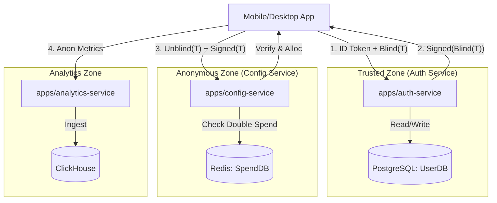
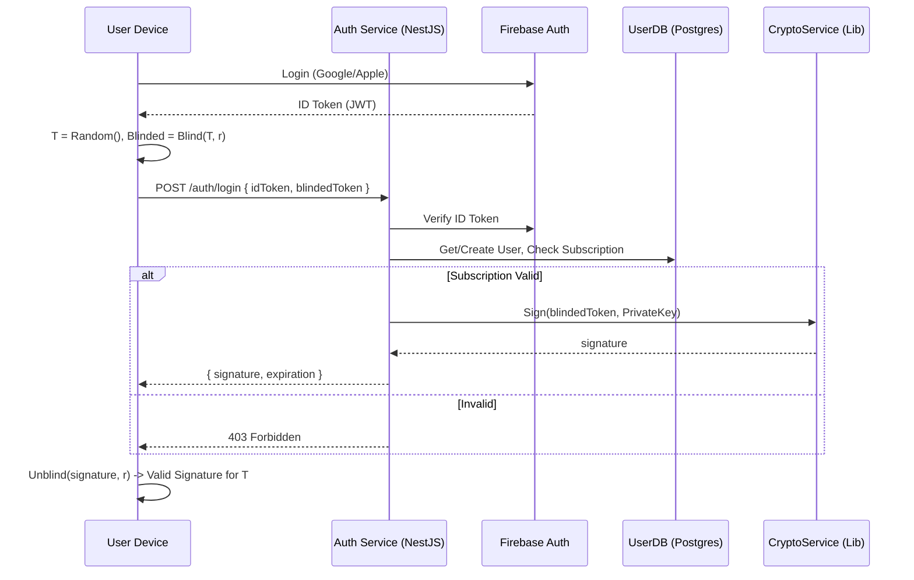
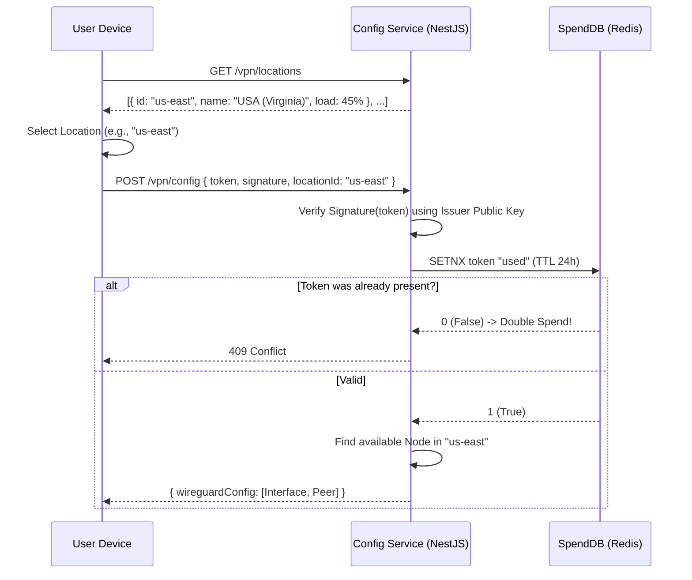
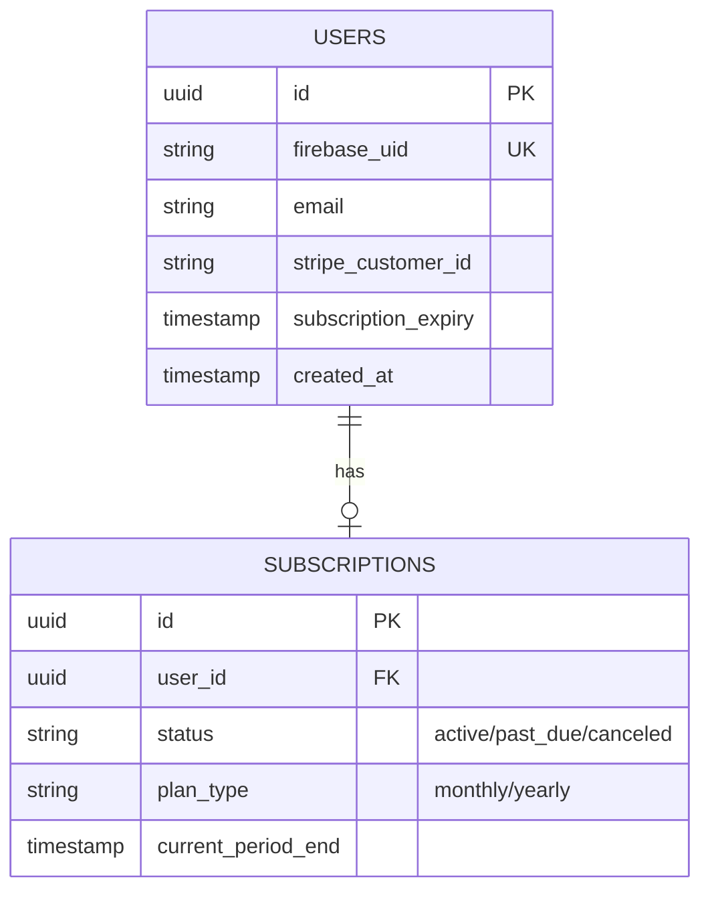

# B2C Backend Detailed Design (Node.js / NestJS)

> **Framework**: [NestJS](https://nestjs.com/) (TypeScript).
> **Architecture**: Monorepo (Nx or Nest Workspace).
> **Database**: PostgreSQL (User Data), Redis (Ephemera/Blind Tokens), ClickHouse (Analytics).

## 1. High-Level Architecture

We will use a **NestJS Monorepo** for shared logic and modular services.



## 2. User Flows & Sequence Diagrams

### Flow A: Authentication & Token Issuance (The "Blind" Sign)

This flow ensures we sign a token permitting VPN usage WITHOUT knowing the token's value.



### Flow B: Token Redemption (Location Selection & Connection)

The user selects a location, then presents the unblinded token to get credentials for that specific region.



## 3. Database Design (ERD)

### UserDB (Postgres) - Connected to `auth-service`

Strictly stores Account & Payment data. NO Usage logs.



### SpendDB (Redis) - Connected to `config-service`

Stores used token hashes to prevent replay attacks.

* **Key**: `spent:<token_hash>`
* **Value**: `timestamp`
* **TTL**: 24-48 hours.

### AnalyticsDB (ClickHouse) - Connected to `analytics-service`

Stores anonymous events.

* **Table**: `session_metrics`
* **Columns**: `session_uuid` (random), `country_code`, `platform` (iOS/Android), `bytes_transferred`, `trackers_blocked`, `duration_seconds`.

## 4. Module & Folder Structure (NestJS Monorepo)

### Root Structure

```text
/backend
├── apps/
│   ├── auth-service/
│   ├── config-service/
│   └── analytics-service/
├── libs/
│   ├── common/           # Shared DTOs, Guards, Decorators
│   ├── crypto/           # Blind Signature Logic (RSA-FDH / Node Buffer)
│   ├── database/         # TypeORM/Prisma Configs
│   └── wireguard/        # Node Selection Algorithms
├── package.json
└── nx.json
```

### Module Breakdown

#### A. `apps/auth-service`

* **Description**: Handles Identity & Payments.
* **Modules**:
  * `AuthModule`: `AuthController` (login endpoints), `AuthService` (Firebase verification).
  * `PaymentModule`:
    * `StripeService`: Syncs `stripe_customer_id` and Webhooks.
    * `AppleStoreService`: Validates IAP Receipts via App Store Server API (`verifyReceipt`).
  * `TokenModule`: Uses `libs/crypto` to sign blinded tokens.
* **Key Files**:
  * `src/auth/auth.controller.ts`: Endpoint `block_blind_sign`.
  * `src/payment/stripe.webhook.ts`: Reacts to `invoice.payment_succeeded`.
  * `src/payment/apple.service.ts`: Validates `latest_receipt` from client.

#### B. `apps/config-service`

* **Description**: Unauthenticated (conceptually) service that trades Tokens for Configs.
* **Modules**:
  * `RedemptionModule`: `RedemptionController` (redeem), `DoubleSpendGuard` (Redis check).
  * `AllocationModule`: Selects best node *within the requested location*.
  * `LocationModule`: Public endpoint returning available regions/countries.
* **Key Files**:
  * `src/redemption/redemption.service.ts`: Verifies crypto signature.
  * `src/allocation/node-selector.ts`: Logic to pick random healthy node in `locationId`.

#### C. `libs/crypto`

* **Description**: Shared cryptographic primitives.
* **Tech**: Use `forge` or `crypto` module with `blind-signatures` implementation.
* **Key Files**:
* `src/blind-scheme.ts`: `sign(blindedMessage, privateKey)`, `verify(message, signature, publicKey)`.
* `src/keys.ts`: Key rotation management (loading current Epoch keys).

#### D. `libs/common`

* **Description**: Shared types to ensure Frontend/Backend alignment.
* **Files**:
  * `dtos/auth.dto.ts`: `LoginRequest { idToken: string, blindToken: string }`.
  * `dtos/vpn-config.dto.ts`: `VpnConfigResponse { privateKey: string, endpoint: string }`.

## 5. Technical Summary & Implementation Notes

1. **Blind Signatures in Node.js**:
    * We will use **RSA-FDH** (Full Domain Hash) or **Bolt** protocol.
    * *Implementation*: Use `node-rsa` or native `crypto` to perform the modular exponentiation required for RSA blinding if a library isn't available. Ensure keys are 2048-bit minimum.
2. **Concurrency**:
    * Node.js Event Loop is perfect for the I/O heavy `auth-service` (waiting on Firebase/Stripe) and `config-service` (waiting on Redis).
3. **Strict Separation**:
    * `auth-service` **MUST NOT** import `AllocatedNode` logic.
    * `config-service` **MUST NOT** import `User` entity or `UserDB` connection.
    * *Enforcement*: Use Nx `module-boundaries` lint rules to forbid `config-service` from importing `libs/database/user-entity`.
4. **Analytics**:
    * Use `Fire-and-Forget` pattern. Client sends UDP or HTTP POST; Service acknowledges immediately, pushes to internal Queue, then Batch Inserts to ClickHouse to handle high scale.
