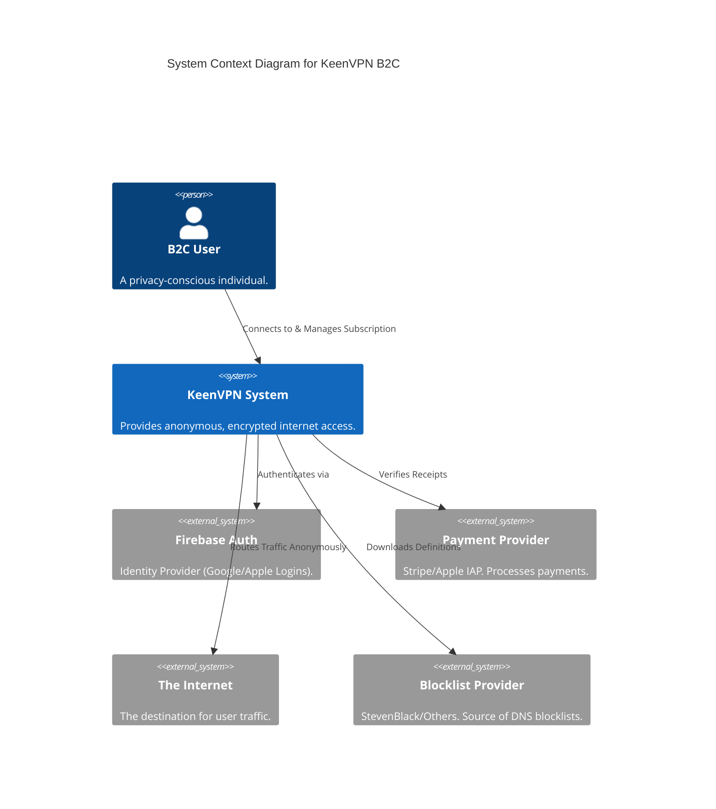
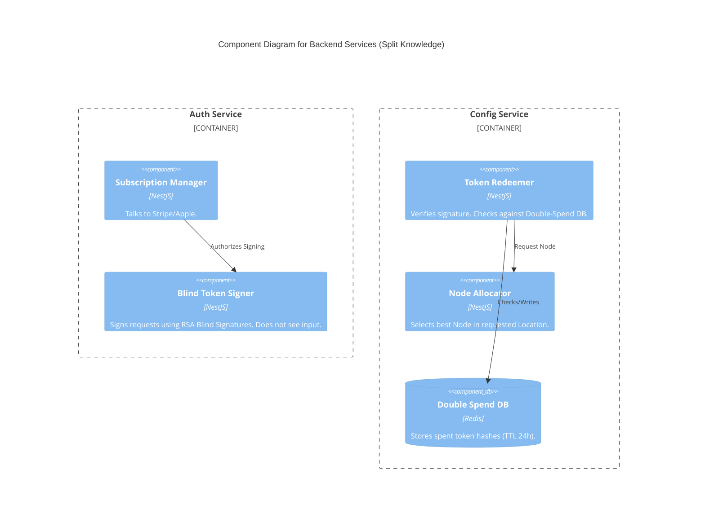

# C4 Model: KeenVPN B2C ("Project Phoenix")

> **Scope**: Consumer VPN Service (Privacy & Anonymity Focus).
> **Notation**: C4 (Context, Containers, Components).

## Level 1: System Context Diagram



## Level 2: Container Diagram

```mermaid
C4Container
    title Container Diagram for KeenVPN B2C

    Person(consumer, "B2C User", "Owner of the device.")

    System_Boundary(c1, "User Device (Client Zone)") {
        Container(app, "Mobile/Desktop App", "Swift/Kotlin", "UI for login, settings, and subscription management.")
        Container(tunnel, "Network Extension", "Swift/Rust", "Handles WireGuard tunnel, DNS Proxy, and AdBlock.")
        Container(store, "Local Storage", "CoreData/Encrypted File", "Stores Config Profiles and Blind Tokens.")
    }

    System_Boundary(c2, "Control Plane (Cloud)") {
        Container(auth, "Auth Service", "NestJS", "Handles User Identity & Payment Verification. Issues Blinded Tokens.")
        Container(config, "Config Service", "NestJS", "Redeems tokens for ephemeral WireGuard credentials. Does NOT know User ID.")
        Container(cdn, "Static Asset CDN", "Cloudflare/AWS S3", "Hosts Blocklists and AdBlock binaries.")
    }

    System_Boundary(c3, "Data Plane (Ephemeral Grid)") {
        Container(wg_node, "WireGuard Node", "Alpine Linux", "Ephemeral VPN termination point. No logging. Route traffic.")
    }

    Rel(consumer, app, "Uses")
    
    Rel(app, auth, "1. Auth (Firebase Token) & Blind Request", "HTTPS/JSON")
    Rel(auth, app, "2. Returns Signed Blind Token", "HTTPS/JSON")
    Rel(app, config, "3. Get Locations, Redeem Token & Connect", "HTTPS/JSON + Token")
    
    Rel(app, tunnel, "Configures & Controls", "IPC/NEProvider")
    Rel(tunnel, wg_node, "4. Encrypted Traffic", "WireGuard (UDP)")
    Rel(tunnel, cdn, "Updates Blocklists", "HTTPS")
    
    Rel(wg_node, Internet, "5. Egress Traffic", "TCP/UDP")
```

## Level 3: Component Diagram (Client Side)

```mermaid
C4Component
    title Component Diagram for Client Network Extension

    Container_Boundary(ne, "Network Extension") {
        Component(lifecycle, "Lifecycle Manager", "Swift", "Handles NEPacketTunnelProvider events, Sleep/Wake, Network Change.")
        Component(wg_wrapper, "WireGuard Adapter", "Rust/Swift", "Wraps `boringtun` or `WireGuardKit`. Manages handshake.")
        Component(dns_proxy, "DNS Proxy / Content Filter", "eBPF/Swift", "Intercepts DNS queries. Checks against Blocklist.")
        Component(kill_switch, "Kill Switch Logic", "Swift", "Drops packets if Tunnel Status != Ready.")
    }
    
    Container_Boundary(storage, "Shared App Group") {
        ComponentDb(block_db, "Bloom Filter Source", "Binary File", "Memory-mapped AdBlock database.")
        ComponentDb(token_store, "Token Store", "Keychain", "Stores blinded tokens.")
    }

    Rel(lifecycle, wg_wrapper, "Starts/Stops")
    Rel(dns_proxy, block_db, "Reads (Memory Map)")
    Rel(wg_wrapper, internet, "Sends Encrypted Packets")
```

## Level 3: Component Diagram (Backend - Auth & Config)


